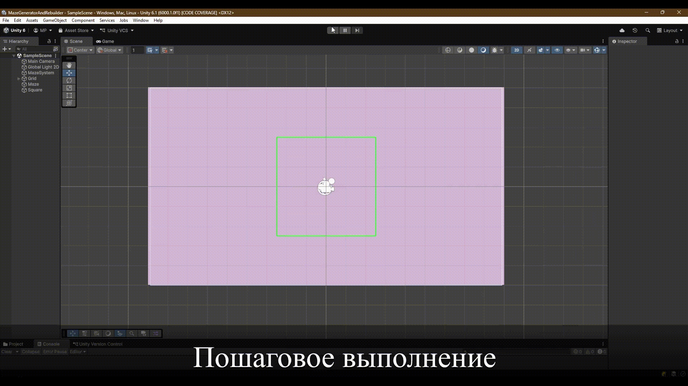

# Maze Generator & Rebuilder 2D

The project was completed for the bachelor's final qualifying work.

Program:
- Generates a 2D maze with preset parameters using the Growing Tree algorithm. The generation can be run step by step, observing the action of the algorithm. 
- Rebuilds the maze depending on the current maze structure and the player's location (as well as any other objects). When a player finds himself in a maze, its structure is completely rebuilt, except for a certain area around the player. This is done in order to avoid unforeseen situations where the player gets stuck in a maze wall collision, as well as to disorient the player in space.

Rebuilding can be disabled.

Step-by-step execution:

